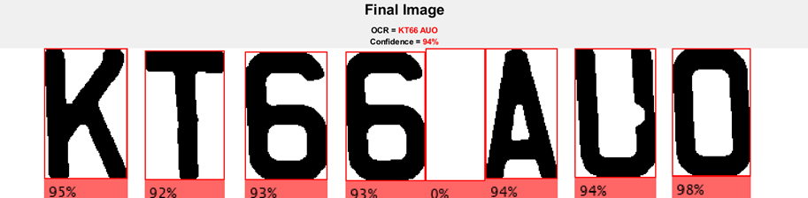

<h1>
  Automatic Number Plate Reader
</h1>

This is part of the coursework for the Image Processing course in the third year of my Computer Science degree, involving image processing techniques such as:

- <a href="https://en.wikipedia.org/wiki/Thresholding_(image_processing)#Multi-band_images">Multi-band thresholding</a>
- <a href="https://en.wikipedia.org/wiki/Mathematical_morphology#Mathematical_morphology_on_complete_lattices">Mathematical morphology</a>
- <a href="https://en.wikipedia.org/wiki/Kernel_(image_processing)#Convolution">Linear filtering (Convolution)</a>
- <a href="https://en.wikipedia.org/wiki/Nonlinear_filter#Noise_removal">Non-linear filtering (Sliding window)</a>
- <a href="https://en.wikipedia.org/wiki/Histogram_equalization">Contrast Adjustments</a>

The aim is to use the yellow from rear UK number plates to extract the informtation and have it read by <a href="https://en.wikipedia.org/wiki/Optical_character_recognition#Text_recognition">OCR</a> to convert to a useable string. Not all of the above techniques were chosen in the final workflow as testing provided evidence for better results than others. The final workflow of techniques is set out below and used two test videos with various yellow distractions to better the accuracy of the workflow, however, only the first video has been uploaded to this repository.

 

<h2 id="TEST">
  Image Processing Workflow
</h2>

<table align="center">
  <tr>
    <th>Test Video</th>
    <th>Value</th>
  </tr>
  <tr>
    <td>Video type</td>
    <td>720p, 30fps</td>
  </tr>
  <tr>
    <td>Video length</td>
    <td>10 seconds</td>
  </tr>
  <tr>
    <td>Number of frames</td>
    <td>299</td>
  </tr>
  <tr>
    <td>Number plate</td>
    <td>KT66 AUO</td>
  </tr>
  <tr>
    <td>Number of correct number plate readings</td>
    <td>296</td>
  </tr>
  <tr>
    <td>Accuracy of correct number plate readings</td>
    <td>99.00%</td>
  </tr>
</table>

 

A still image was used to attain a base workflow that was specific enough to pick up and extract the information from the yellow number plate. This was then adapted to be generalised for the different scenarios presented through videos that contain a significant number of frames.

 

  

 

### Thresholding
A multi-band-pass threshold was used and focused on capturing the red and green channels that make up yellow, whilst having a low blue value. As seen in the table below, red and green upper bands were maxed at 255 and focused the lower bands on the 100-150 area, which came down to trial and error to ensure enough yellow could pass through. The blue lower band was grounded at 0 and with trial and error had a max upper band at around 50. The wide gaps in the thresholding stage would mean more false positives passed through and so these were expected to be handled by the morphing procedures.

<table align="center">
  <tr>
    <th colspan="2">Red</th>
    <th colspan="2">Green</th>
    <th colspan="2">Blue</th>
  </tr>
  <tr>
    <td>Lower</td>
    <td>Upper</td>
    <td>Lower</td>
    <td>Upper</td>
    <td>Lower</td>
    <td>Upper</td>
  </tr>
  <tr>
    <td>145</td>
    <td>255</td>
    <td>125</td>
    <td>255</td>
    <td>0</td>
    <td>49</td>
  </tr>
  </tr>
</table>

### Morphological Operators
Morphing started with a <a href="https://en.wikipedia.org/wiki/Closing_(morphology)">close</a> operation to fill the number plate into a single cluster. Tests starting with <a href="https://en.wikipedia.org/wiki/Erosion_(morphology)">eroding</a> as per the former workflow resulted in too much damage to the number plate cluster. The <a href="https://en.wikipedia.org/wiki/Opening_(morphology)">open</a> operation then split any false positives back to their original clusters without affecting the number plate cluster. Erode then annihilates the false positives. Then, <a href="https://en.wikipedia.org/wiki/Dilation_(morphology)">dilating</a> repairs the damage to the number plate from the two previous operations.

### Rotation
After significant testing, OCR had difficulty reading the number plate if the text was not horizontal enough as the videos did not use a Steadicam. This revelation resulted in a function to handle counter-rotating the number plate against the original image by taking the area of interest’s orientation away from zero. After implementation, OCR read at least a single character in every frame.

### Scaling
Reading the documentation on OCR, increased accuracy was available if the image to read was larger by two to three times. This understanding resulted in scaling the image by three times so that the edges of the characters were more defined and more manageable for OCR to read.

### Contrast
To allow for more precise character recognition, adjusting the image to reduce the effect of any shadows as the contrast between the yellow and black increased, converting to the <a href="https://en.wikipedia.org/wiki/CIELAB_color_space">L\*a\*b\*</a> colour space allowed for targeting the lightness values.

### Binarization
Through trial and error, OCR preferred reading black text on a white background. By converting the final image to black and white increased the result accuracy significantly. With the image back to binary, further morphological operations (dilation & erosion) removed small text like the number plate manufacturer’s name that OCR was picking up.

### Training
After this point, OCR struggled with reading the ‘O’ correctly at the end of the number plate in the first video because the shape is unusual in that it is taller than it is wide. By training OCR with the official UK number plate font, OCR read every character with enhanced accuracy.
